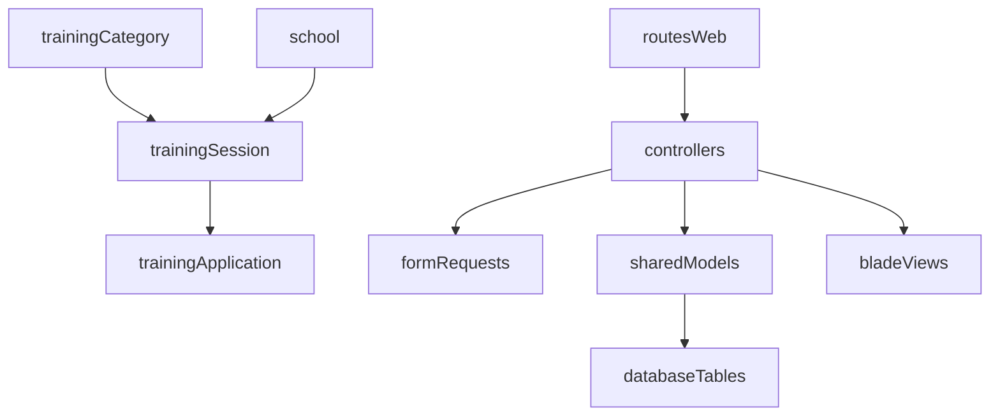

# Plan de duplication training

## Hypothèses retenues (par défaut)
- Je garde **tes noms actuels** quand ils existent déjà (y compris variantes `Traning/Traninh`) pour éviter de casser le code en place.
- Le scope inclut les 4 entités demandées: **training-session**, **training-application**, **training-category**, **school**.
- `training-vacancy` reste hors scope principal sauf si demandé ensuite.

## Références à recopier
- Routes et structure resource: [`job-backoffice/routes/web.php`](job-backoffice/routes/web.php)
- Exemples complets CRUD backoffice:
  - [`job-backoffice/app/Http/Controllers/JobVacancyController.php`](job-backoffice/app/Http/Controllers/JobVacancyController.php)
  - [`job-backoffice/app/Http/Controllers/JobApplicationController.php`](job-backoffice/app/Http/Controllers/JobApplicationController.php)
  - [`job-backoffice/resources/views/job-vacancy`](job-backoffice/resources/views/job-vacancy)
  - [`job-backoffice/resources/views/job-application`](job-backoffice/resources/views/job-application)
  - [`job-backoffice/resources/views/job-category`](job-backoffice/resources/views/job-category)
  - [`job-backoffice/resources/views/company`](job-backoffice/resources/views/company)
- Modèles partagés existants:
  - [`job-shared/src/models/TrainingCategory.php`](job-shared/src/models/TrainingCategory.php)
  - [`job-shared/src/models/School.php`](job-shared/src/models/School.php)
  - [`job-shared/src/models/TraningApplication.php`](job-shared/src/models/TraningApplication.php)
  - [`job-shared/src/models/TraningSession.php`](job-shared/src/models/TraningSession.php)

## Implémentation détaillée
1. **Stabiliser les models training dans `job-shared`**
   - Vérifier et aligner `table`, `fillable`, `casts`, `relations` sur le pattern mature job.
   - Corriger les incohérences de relations/FK pour que les 4 entités soient liées comme suit:
     - `School -> hasMany TrainingSession`
     - `TrainingCategory -> hasMany TrainingSession`
     - `TrainingSession -> belongsTo School + TrainingCategory; hasMany TrainingApplication`
     - `TrainingApplication -> belongsTo TrainingSession`
   - Garder les noms de classes/fichiers conformément à l’état actuel du repo (hypothèse par défaut).

2. **Créer/compléter les migrations backoffice pour les tables training**
   - Ajouter une migration par entité (`training_categories`, `schools`, `training_sessions`, `training_applications`).
   - Reprendre les conventions existantes: `uuid` PK, timestamps, `softDeletes`, FK explicites.
   - Respecter le style de colonnes utilisé actuellement dans le projet (FK en camelCase déjà présent ailleurs).

3. **Créer les Request classes dédiées (validation)**
   - Générer `Create/Update Request` selon le même style que `Company` et `JobVacancy`.
   - Définir règles par entité (required, formats, FK exists, bornes de dates/nombres).

4. **Créer/compléter les Controllers backoffice**
   - Ajouter 4 controllers resource (index/create/store/show/edit/update/destroy) + `restore` (soft-delete).
   - Copier le comportement des modules existants: pagination, recherche simple si présente, flash messages, redirections nommées.
   - Injecter les Request classes dans `store`/`update`.

5. **Créer les vues Blade pour chaque entité**
   - Créer les dossiers:
     - `resources/views/training-session`
     - `resources/views/training-application`
     - `resources/views/training-category`
     - `resources/views/school`
   - Ajouter `index/create/edit/show` (ou aligner exactement avec le domaine source si `show` absent).
   - Réutiliser les composants/layouts déjà en place pour cohérence UI.

6. **Brancher les routes et navigation**
   - Ajouter `Route::resource(...)` + route `restore` pour chaque nouveau domaine dans [`job-backoffice/routes/web.php`](job-backoffice/routes/web.php).
   - Ajouter les entrées menu/navigation si les autres domaines les exposent déjà.

7. **Vérification de bout en bout**
   - Vérifier que chaque page CRUD charge, crée, met à jour, supprime/restaure.
   - Vérifier intégrité des relations via formulaires (select FK) et affichage.
   - Contrôler erreurs lint/syntaxe PHP et cohérence des imports/classes.

## Flux cible

## Résultat attendu
- Les 4 modules training sont au même niveau de complétude que `job-application`, `job-vacancy`, `job-category`, `company` (models + migrations + requests + controllers + views + routes + restore soft-delete), tout en respectant les noms actuellement présents dans ton repo.