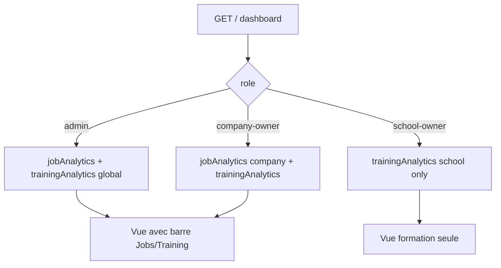

# Dashboard Jobs / Training et acces school-owner

## Objectifs (feedback integre)

1. **Admin** : une seule page dashboard avec une **barre a deux options** (onglets ou segments) **Jobs** et **Training**, chaque panneau affiche **ses propres statistiques** (pas deux pages separees dans la nav pour l admin).
2. **Company-owner** : **meme UX** que l admin (barre Jobs / Training), avec les stats **emploi deja scopees a sa societe** (`companyOwnerDashbord`) et les stats **formation** comme aujourd hui (globales sur les sessions, sauf evolution metier ulterieure).
3. **School-owner** : **acces au dashboard** (`route('dashboard')` apres login) avec statistiques **uniquement pour son ecole** (`auth()->user()->school`), en miroir du principe **company-owner** qui ne voit que sa company pour le volet emploi. Pour le school-owner : **metriques formation** (sessions de son `schoolId`, candidatures rattachees a ces sessions, conversions, etc.). **Pas** de stats jobs pertinentes (masquer l onglet Jobs ou afficher uniquement l onglet Training).

## Contexte technique

- [`job-backoffice/routes/web.php`](job-backoffice/routes/web.php) : aujourd hui `GET /` + `role:admin,company-owner` seulement.
- [`job-backoffice/app/Http/Controllers/DashboardController.php`](job-backoffice/app/Http/Controllers/DashboardController.php) : `adminDashbord` / `companyOwnerDashbord` (jobs).
- Relation [`job-shared/src/models/User.php`](job-shared/src/models/User.php) — `User::school()` (`hasOne` School par `ownerId`).

## Implementation proposee

### Routes et auth

- Changer le middleware du groupe contenant `Route::get('/', ...)` en `role:admin,company-owner,school-owner` (ou deplacer la route dashboard dans un groupe dedie avec ces trois roles).
- Conserver le nom de route **`dashboard`** sur `GET /` pour ne pas casser les redirections auth et les tests Pest.
- Verifier que **school-owner** ne recoit pas par erreur des routes jobs (job-vacancy, etc.) : si le groupe actuel melange dashboard + ressources jobs, **extraire** `GET /` dans un petit groupe `auth + role:admin,company-owner,school-owner` et laisser les ressources jobs en `admin,company-owner` uniquement.

### Controleur

- **`index()`** unique : selon `auth()->user()->role` :
  - `admin` : calculer `$jobAnalytics` (ex-`adminDashbord`) + `$trainingAnalytics` (ex-`adminTrainingDashboard`).
  - `company-owner` : `$jobAnalytics` (ex-`companyOwnerDashbord`) + `$trainingAnalytics` (ex-`companyOwnerTrainingDashboard` ou global selon regle metier actuelle).
  - `school-owner` : si pas d ecole, tableaux vides + message ; sinon `$trainingAnalytics` = **`schoolOwnerTrainingDashboard($school)`** (filtre `TrainingSession::where('schoolId', $school->id)`, `TrainingApplication` via `whereHas('trainingSession', ...)`). Ne pas passer de stats jobs (ou null + flag `showJobTab => false`).
- Methodes privees dediees : `adminTrainingDashboard()`, `companyOwnerTrainingDashboard()`, `schoolOwnerTrainingDashboard(School $school)` (totaux sessions, candidatures, top sessions, conversion viewCount / candidatures).

### Vue

- Remplacer / refactoriser [`job-backoffice/resources/views/dashboard/index.blade.php`](job-backoffice/resources/views/dashboard/index.blade.php) :
  - **Barre horizontale** (boutons ou onglets) : « Jobs » | « Training » (visible seulement si `showJobTab` / role admin ou company-owner).
  - Deux panneaux (divs) : contenu actuel cartes + tables **deplace** dans le panneau Jobs ; nouveau panneau Training (cartes + tables analogues).
  - Comportement : **sans framework lourd** — Alpine.js si deja disponible dans le projet, sinon **details/summary**, ou **radio inputs + labels CSS** pour afficher un panneau a la fois.
- **School-owner** : une seule zone (formation) sans barre Jobs, ou barre avec un seul onglet actif.

### Navigation

- [`job-backoffice/resources/views/layouts/navigation.blade.php`](job-backoffice/resources/views/layouts/navigation.blade.php) : ajouter le lien **Dashboard** pour `school-owner` (comme les autres roles), `:active` sur `request()->routeIs('dashboard')`.
- **Ne pas** ajouter deux liens separes « Job dashboard » / « Training dashboard » pour l admin (remplace l ancienne idee du plan) : la bascule est **dans la page**.

### Tests

- Ajuster les tests qui supposent `role:job-seeker` ou 403 sur `/` si applicable.
- Test minimal : `school-owner` avec ecole accede a `GET /` → 200 et contient des elements training scopes (optionnel).

## Fichiers principaux

| Fichier | Action |
|---------|--------|
| `job-backoffice/routes/web.php` | Scinder middlewares : dashboard pour 3 roles ; ressources jobs inchangées pour admin,company-owner |
| `job-backoffice/app/Http/Controllers/DashboardController.php` | `index()` + helpers training + `schoolOwnerTrainingDashboard` |
| `job-backoffice/resources/views/dashboard/index.blade.php` | Barre onglets + deux panneaux + branche school-owner |
| `job-backoffice/resources/views/layouts/navigation.blade.php` | Lien Dashboard pour school-owner |

## Diagramme (flux)

